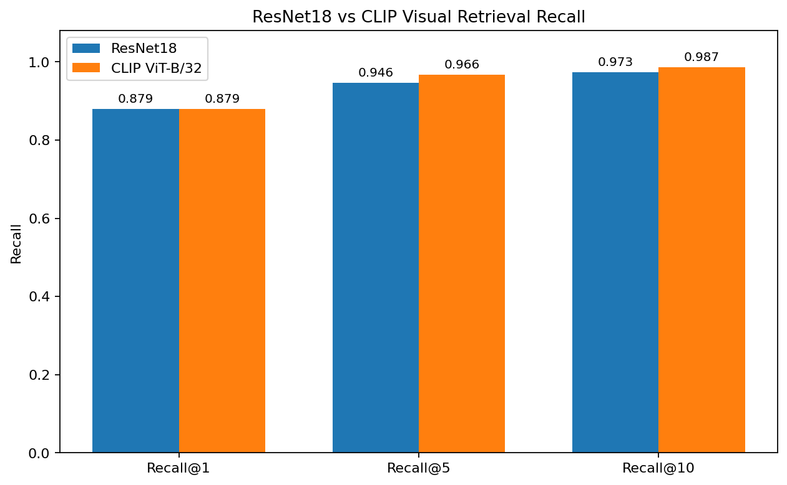
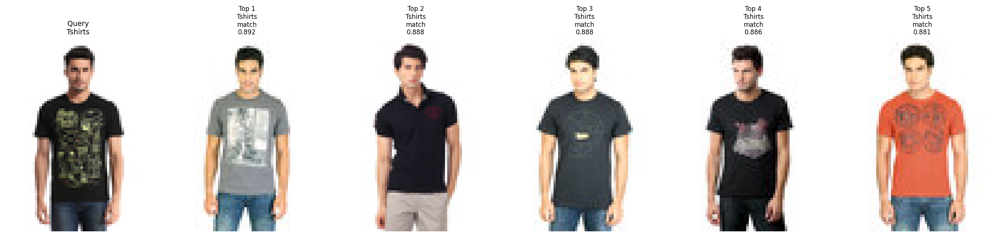
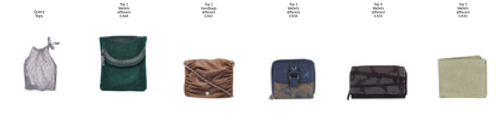
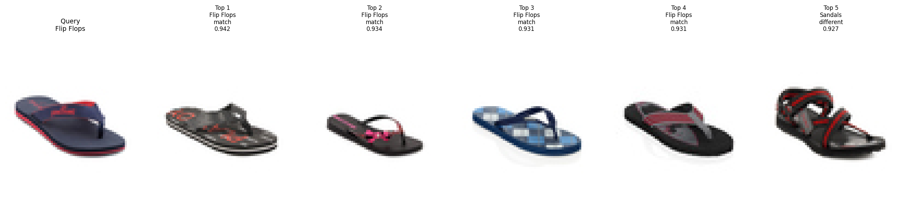
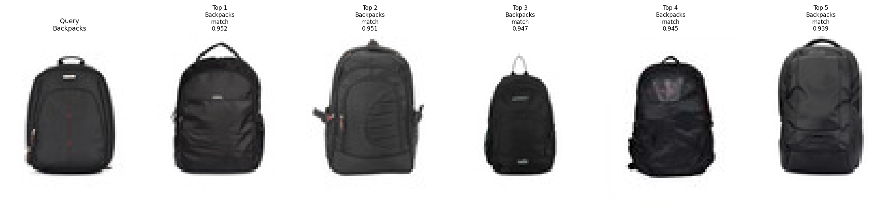
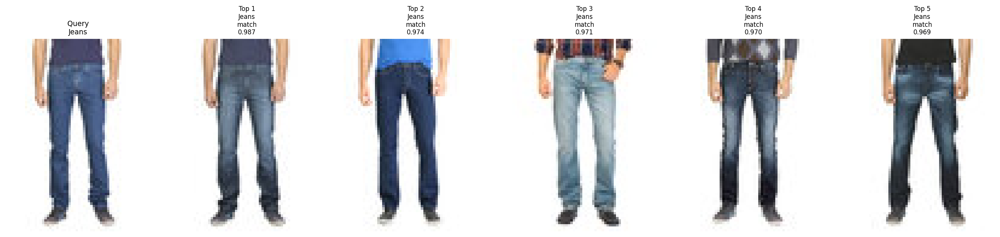

# Product Visual Search and Retrieval Using ResNet18 and CLIP

Course Project Report  
Date: April 26, 2026  
Author: Student Name

## Abstract

This project builds a product visual search system using the Kaggle Fashion Product Images Small dataset. It compares a supervised ResNet18 baseline with a frozen CLIP ViT-B/32 visual-semantic embedding model. Retrieval is evaluated using Recall@K, which is more aligned with visual search than classification accuracy. On the debug subset, CLIP achieves stronger Recall@5 and Recall@10 than ResNet18.

## Introduction

Product visual search allows users to find visually similar products using an image as the query. E-commerce and content platforms benefit from this capability because users often search by appearance, style, or visual intent rather than exact product names. Classification accuracy alone is insufficient because a visual search system needs to return a ranked list of relevant candidate products. This project extracts image embeddings and retrieves similar products by cosine similarity.

## Dataset and Preprocessing

- Total scanned images: 44,441
- Label source: `articleType` from `styles.csv`
- Debug subset: 20 classes, up to 50 images per class, about 1,000 images
- Train/gallery size: 725
- Validation size: 126
- Test/query size: 149
- Duplicate extracted image folders were handled by prioritizing `data/raw/images/` to avoid train/test leakage.

## Methodology

### ResNet18 Supervised Baseline

ResNet18 is a residual network. Residual connections help train deeper networks by allowing layers to learn corrections to earlier representations. In this project, ResNet18 is trained using `articleType` labels, and the penultimate 512-dimensional feature vector is used as the image embedding for retrieval.

### CLIP-based Retrieval

CLIP stands for Contrastive Language-Image Pre-training. It is a vision-language pretrained model. This project uses only the frozen CLIP image encoder from a local checkpoint: `models/huggingface/timm_vit_base_patch32_clip_224_openai/open_clip_model.safetensors`. CLIP is not fine-tuned on the current dataset.

### Image Retrieval Pipeline

The retrieval pipeline embeds query and gallery images, computes cosine similarity, returns Top-K nearest images, and evaluates Recall@1, Recall@5, and Recall@10.

## Experimental Setup

The experiments use `DEBUG_MODE = True`, 20 classes, at most 50 images per class, a gallery size of 725, and a query size of 149. Both ResNet18 and CLIP produce 512-dimensional embeddings. CUDA/GPU was used. The full 44,441-image dataset was not trained in this report.

## Results

| Model | Training Strategy | Embedding Dim | Top-1 Acc | Top-5 Acc | Recall@1 | Recall@5 | Recall@10 | Runtime |
|---|---|---:|---:|---:|---:|---:|---:|---:|
| ResNet18 | Supervised training on articleType | 512 | 0.8792 | 0.9866 | 0.8792 | 0.9463 | 0.9732 | 18.68s |
| CLIP ViT-B/32 | Frozen pretrained image encoder | 512 | N/A | N/A | 0.8792 | 0.9664 | 0.9866 | 11.55s |

## Discussion

ResNet18 and CLIP have nearly identical Recall@1, while CLIP has higher Recall@5 and Recall@10. This suggests that CLIP provides a stronger candidate set for Top-K retrieval. ResNet18 is a dataset-specific supervised baseline, while CLIP is a general-purpose pretrained visual-semantic representation. For visual search, Top-K retrieval is more important than a single class prediction because users usually expect a set of similar products.

## Business Interpretation

Product visual search helps users find similar products from images. Higher Recall@K means the system is more likely to return relevant products near the top of the ranking. CLIP's strong performance without training suggests that pretrained foundation models can reduce training cost. ResNet18 remains useful as a lightweight supervised baseline or local customized model.

## Limitations

The experiment uses a debug subset rather than the full dataset. `articleType` is a category-level label, not a fine-grained product identity label. CLIP is not fine-tuned, and the retrieval metric does not consider attributes such as color, brand, style, gender, season, or usage.

## Future Work

Future work includes medium-scale evaluation, full-dataset retrieval, CLIP fine-tuning, product attribute-aware retrieval, FAISS indexing, fine-grained retrieval beyond `articleType`, and deployment as a visual search demo.

## Conclusion

The project successfully constructs an end-to-end product visual search pipeline. ResNet18 validates supervised learning for product recognition and retrieval, while CLIP demonstrates that pretrained vision-language models can provide strong retrieval embeddings without dataset-specific training. CLIP's better Recall@5 and Recall@10 indicates strong practical value for product visual retrieval.

## CLIP Retrieval Examples

